# Satellite Collision Avoidance Simulation

Simülasyon ve Modelleme Dersi — Final Projesi  
**Konu:** Uzay ve Navigasyon Sistemleri / Satellite Collision Avoidance

---

## Proje Hakkında

Düşük Dünya yörüngesindeki (LEO) uyduların birbirine yaklaşma durumlarını (conjunction) tespit eden, çarpışma olasılığını hesaplayan, kaçınma manevrası planlayan ve istatistiksel güven aralıkları üreten kapsamlı bir Python simülasyonu.

---

## Modelleme

- **Yörünge yayma:** İki cisim problemi + J2 pertürbasyonu, RK45 (`rtol=1e-10`)
- **Koordinat sistemi:** ECI (Earth-Centered Inertial), LVLH (manevra çerçevesi)
- **Çarpışma olasılığı (Pc):** Chan 2D projeksiyon — göreli hıza dik düzlemde Gauss integrali
- **Manevra planlama:** ±Along-track / ±Radial / ±Cross-track — binary search ile minimum Δv
- **V&V:** 5 doğrulama/geçerleme testi (enerji korunumu, gidiş-dönüş, Kepler periyot, Pc sınır)
- **İstatistiksel analiz:** N=200 Monte Carlo replikasyonu, %95 bootstrap güven aralığı

---

## Simülasyon Senaryoları

| Senaryo | Açıklama | Miss Distance | Pc | Risk |
|---|---|---|---|---|
| S1: Low-Risk Near-Miss | i=53° ve i=168° kavşak yörüngesi | 5424 m | 1.2e-6 | LOW |
| S2: High-Risk Conjunction | Daha yakın geçiş, küçük kovaryans | 585 m | 1.9e-4 | HIGH |
| S2: After Maneuver | Optimal Δv manevrası sonrası | 1300 m | 1.0e-5 | LOW |
| S3: Delta-V Analizi | dV vs. miss distance & Pc eğrileri | — | — | — |
| S4: Multi-Debris | 5 debris nesnesi, öncelik sıralaması | 253–7145 m | — | — |

---

## Kurulum ve Çalıştırma

Gerekli kütüphaneleri yükleyin:
```bash
pip install numpy scipy matplotlib pillow
```

**Kullanıcı Arayüzü (GUI) ile Çalıştırma (Önerilen):**
Projenin görsel arayüzü ile tüm senaryoları, V&V testlerini ve Monte Carlo simülasyonunu tek tıkla çalıştırabilirsiniz:
```bash
python gui.py
```

**Terminal / Komut Satırı ile Çalıştırma:**
```bash
python main.py                    # Tüm senaryolar + V&V + Monte Carlo
python main.py --scenario 2       # Yalnızca Senaryo 2
python main.py --verify           # Yalnızca V&V testleri
python main.py --monte-carlo      # Yalnızca Monte Carlo analizi
```

---

## Dosya Yapısı

```
├── orbital_mechanics.py    # Fizik motoru — J2, RK45, koordinat dönüşümleri
├── satellite.py            # Uydu veri modeli (Kepler + kovaryans)
├── collision_detection.py  # TCA bulma, Chan 2D Pc hesabı
├── avoidance.py            # Δv manevra planlama (6 yön)
├── scenarios.py            # 4 simülasyon senaryosu
├── visualization.py        # Grafik, animasyon, flowchart üretimi
├── verification.py         # V&V — 5 doğrulama ve geçerleme testi
├── monte_carlo.py          # N=200 replikasyonluk Monte Carlo analizi
├── main.py                 # Terminal giriş noktası (--scenario/--verify/--monte-carlo)
├── gui.py                  # Tkinter grafik kullanıcı arayüzü (Tavsiye edilen)
├── requirements.txt
├── docs/
│   └── matematiksel_model.md   # Denklemler, varsayımlar, kütüphaneler
└── results/                # Üretilen grafikler, animasyon, raporlar
    ├── system_flowchart.png
    ├── vv_energy_conservation.png
    ├── vv_pc_boundary.png
    ├── vv_report.txt
    ├── mc_pc_histogram.png
    ├── mc_report.txt
    └── s1…s4_*.png / s2_*.gif
```

---

## V&V Sonuçları

| Test | Açıklama | Sonuç |
|---|---|---|
| V1 | Enerji korunumu (5 tur, J2 dahil) | GEÇER ✓ |
| V2 | Elemanlar → durum → elemanlar gidiş-dönüş | GEÇER ✓ |
| V3 | Dairesel yörüngede v = √(μ/a) | GEÇER ✓ |
| G1 | Kepler 3. yasası periyot geçerlemesi | GEÇER ✓ |
| G2 | Pc sınır koşulları (uzak→0, yakın→yüksek) | GEÇER ✓ |

---

## Monte Carlo Özeti (N=200, Senaryo 2)

| İstatistik | Değer |
|---|---|
| Ortalama Pc | 1.68e-05 |
| Std. sapma | 3.80e-05 |
| %95 Güven Aralığı | [1.18e-05, 2.22e-05] |
| P(Pc ≥ 1e-4) | 6.0% |

---

## Sonuçlar

### Sistem Akış Diyagramı
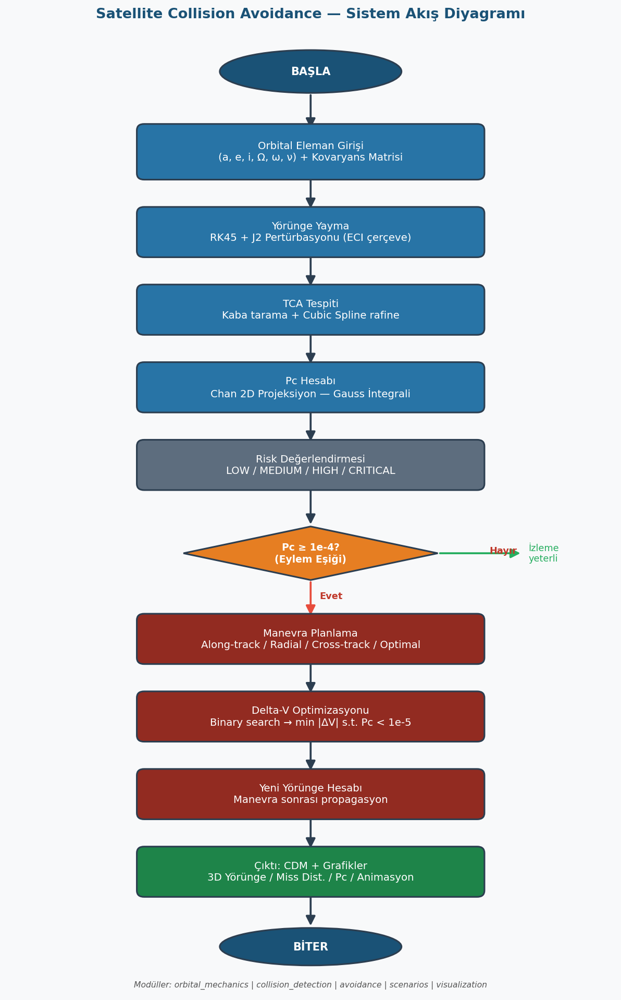

### V&V — Enerji Korunumu
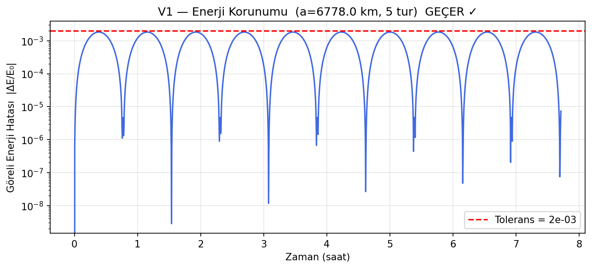

### Monte Carlo — Pc Dağılımı
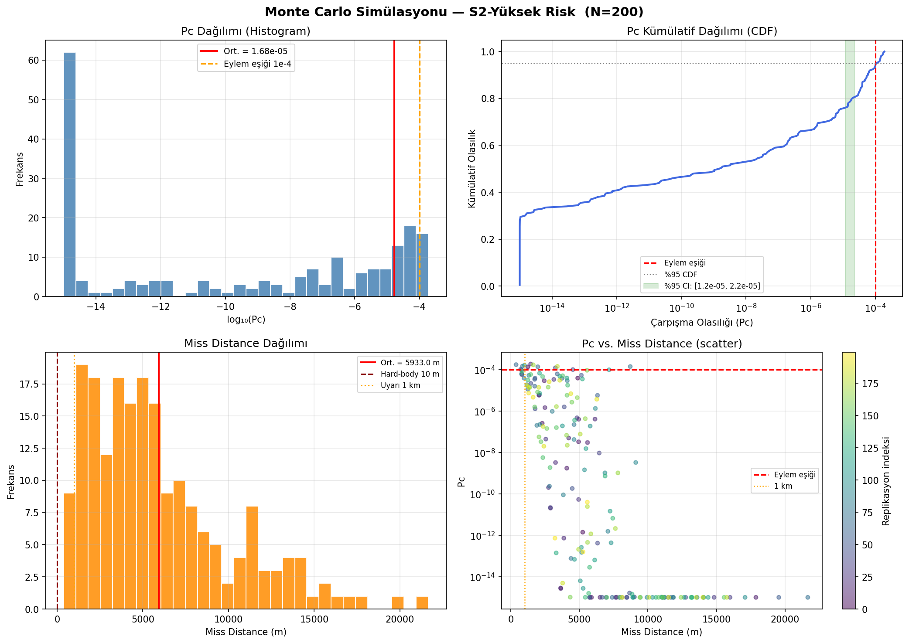

### Senaryo 1 — Düşük Risk
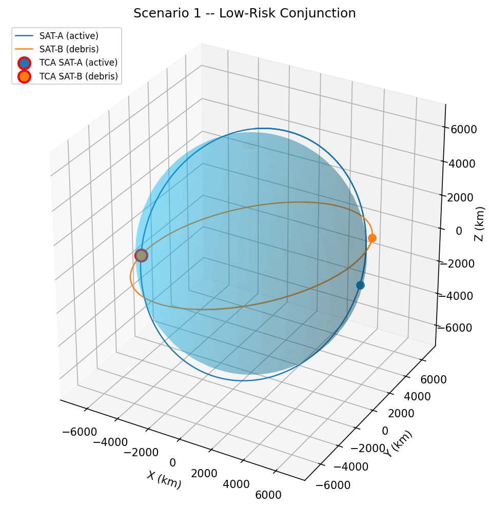
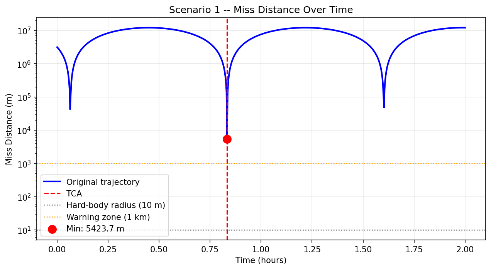

### Senaryo 2 — Yüksek Risk + Manevra
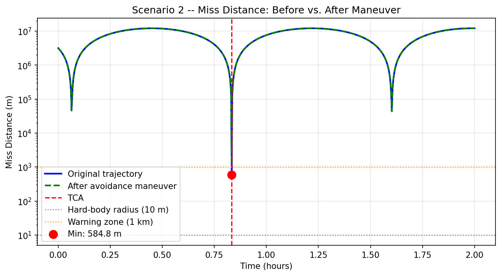
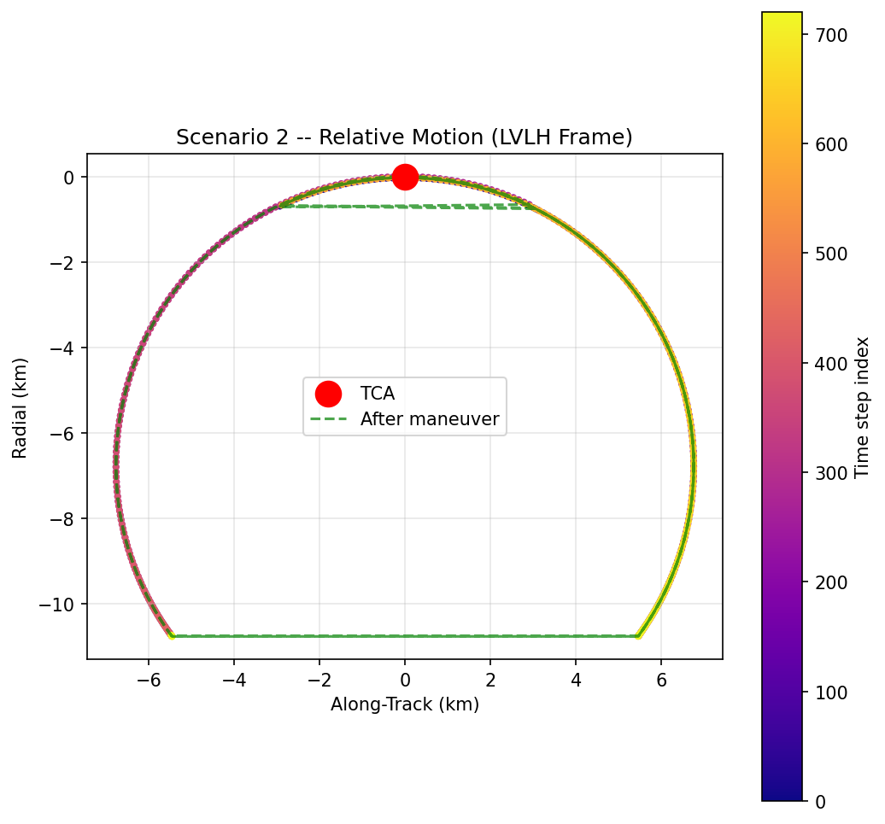

### Senaryo 3 — Delta-V Analizi
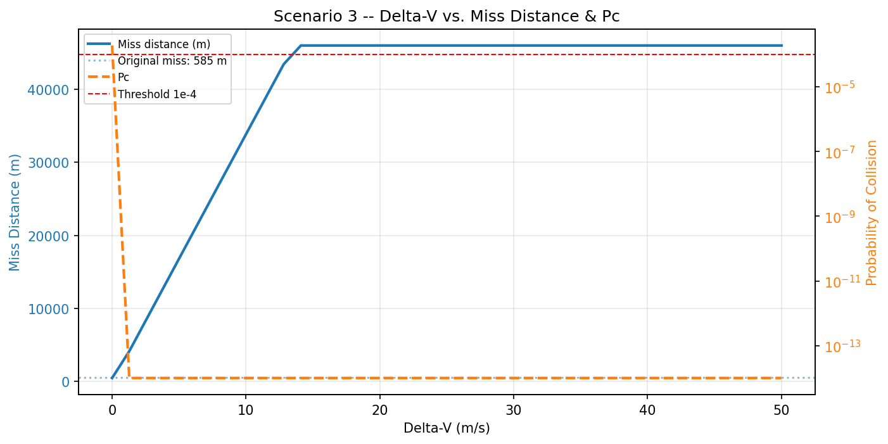
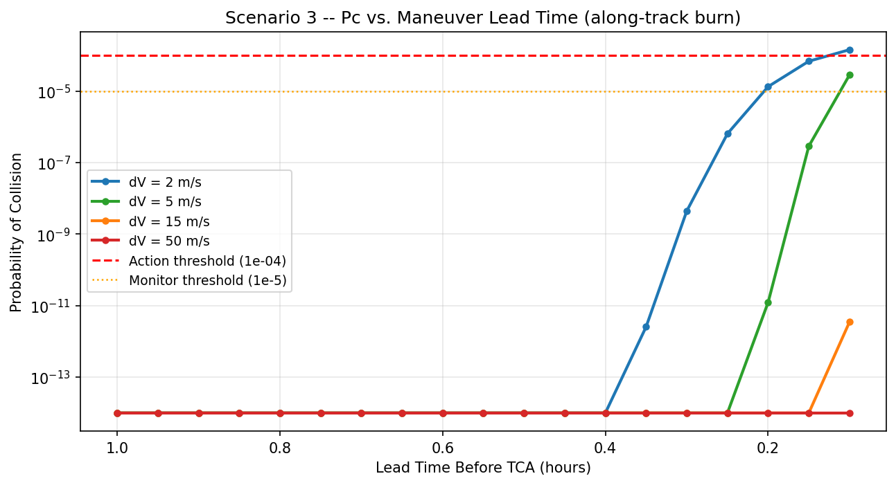

### Senaryo 4 — Çoklu Debris
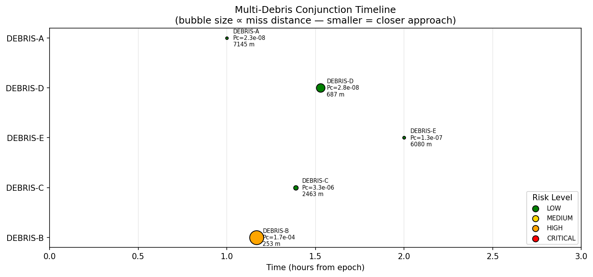

### Tüm Senaryolar Karşılaştırması
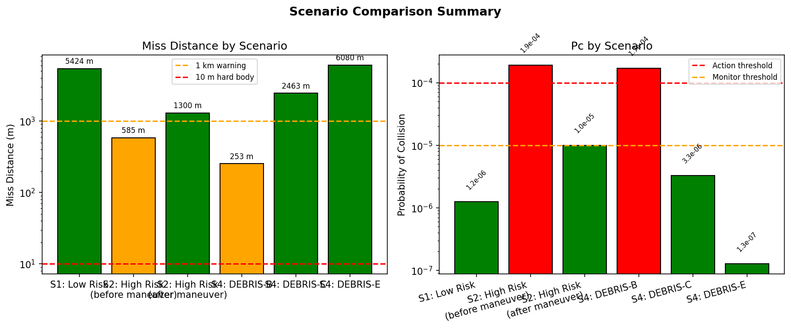

---

## Animasyon

Senaryo 2 konjunksiyon penceresi (orijinal vs. manevra sonrası):

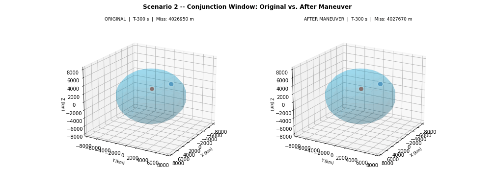

> Not: GIF animasyon VS Code'da statik görünür. Tarayıcıda açınız.
